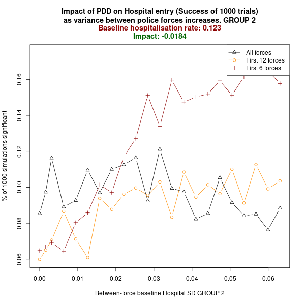

---
output:
   bookdown::html_document2:
      toc: true
      toc_float:
         collapsed: false
      toc_depth: 3
      number_sections: true
   bookdown::pdf_document2:
      toc: true
      toc_depth: 2
      number_sections: true
      keep_tex: yes
header-includes:
   - \usepackage{booktabs}
   - \PassOptionsToPackage{table}{xcolor}
   - \usepackage{colortbl}
   - \definecolor{pastelred}{rgb}{1.0, 0.5, 0.5}
   - \definecolor{pastelgreen}{rgb}{0.6, 1.0, 0.6}
   - \usepackage{float}
always_allow_html: true
title: Police Diversion & Drugs (PDD) Model Simulation - Interim report
subtitle: Ashley Mills, Dan Lewer, Jack Cunliffe
---

# Summary

A statistical model was created to assess the power of three primary outcomes for Police Diversion & Drugs (PDD) intervention: Reoffending rate, Drug treatment rate, and hospitalisation count. Simulations revealed good power for drug treatment as an outcome which was relatively robust to between-force variance, good to moderate power for reoffending rate but with sensitivity to between-force variance, and poor power for hospitalisation count. It is recommended that baseline reoffending rates be estimated for police forces to improve statistical power of the cohort study and introduce the possibility of using a weighted reoffending statistic. A more eventful hospital outcome should be explored as a secondary outcome to increase the power of this outcome.

# Introduction

A comparative study between police forces that do or do not implement some form of Police Diversion & Drugs (PDD) scheme has been suject to simulation for the purpose of exploratory analysis. The primary outcomes simulated are:

1. Reoffending rate - A participant either reoffends within a year of PDD or does not.
2. Treatment rate - A participant either enters into drug treatment within a year of PDD or not.
2. Hospitalisation count - A participant can be hopsitalised for a drug related incident zero or more times within a year of PDD.

Reoffending and treatment rates are simulated as binomial distributions and hospitalisation is simulated as a negative binomial distribution, this provides between-individual variance.

These distributions are parameterised on a per-force basis so that between-force variance can be introduced through the baseline rates.

A given random instantiation randomises both force data and individual level data per force. 

By averaging over 1000 such instances, and fitting models for each instance and outcome, an estimate of the power of each outcome given the assumptions can be made. This document outlines the findings from this process.

# Parameterisation

## Police forces

We assume a mean per-force participation count of ```r testConfig$police$mean_pdd_participants_per_force``` and then derive a specific per-force participation rate by distributing this mean according each force's population. Expected PDD status is obtained from current knowledge of UK police force participation for the project. Table \@ref(tab:policeForces) below shows the force data that remains constant between simulation runs. In practice a given random instance will contain columns for baseline outcome rates that vary between instantiations.

```{r policeForces,echo=F}
# Check the output format

dtOut <- modelTestData$pf[,c("PoliceForceID","UsesPDD","Population","ParticipantCount","PersistentOffenderFraction")]
dtOut$UsesPDD <- fifelse(dtOut$UsesPDD,"TRUE","FALSE")
table_caption <- "Fixed police force data used in the simulation runs"
if(knitr::is_html_output()) {
   datatable(
      dtOut,
      caption="Fixed police force data used in the simulation runs",
      options=list(
         ordering=F,
         dom="t",
         pageLength=18
      ),
      rownames=F
   ) %>% formatStyle('UsesPDD',backgroundColor = styleEqual(c('TRUE', 'FALSE'), c('#98FB98', '#FFC0CB')))
} else {
   cell_colors <- ifelse(dtOut$UsesPDD == "FALSE", "pastelred", "pastelgreen")
   kable(dtOut, caption=table_caption,"latex", booktabs = T, row.names = FALSE) %>% 
      kable_styling(latex_options = "HOLD_position") %>% 
      kable_styling(position = "center") %>% #, latex_options = c("full","striped", "repeat_header"), stripe_color = "gray!15") %>%
      column_spec(2,background=cell_colors,latex_column_spec="l")
}
```

Offenders fall into two categories:

1. Group 1: Low level offenders
2. Group 2: Persistent offenders (typically drug dependent)

In the above table we characterise this using the parameter ```PersistentOffenderFraction```.

It can be observed that for police forces that do not implement PDD, this value is 0.5 as it assumed that these "control" forces have a 50/50 split of offender types. Police force PDD schemes usually target one or the other offender group. For this reason if a force targets Group 1, it is assumed that there ```PersistentOffenderFraction``` is 0 and if a force targets Group 2 it is assumed that their ```PersistentOffenderFraction``` is 1. Thus the above table captures both the semantics of whether a police force uses PDD and which offender group it targets. The summarised information is shown in Table \@ref(tab:pddSummary)


```{r pddSummary,echo=F}
pfCategories <-  modelTestData$pf[,list(PoliceForces=paste(PoliceForceID,collapse=' ')),by="PersistentOffenderFraction"]
pfCategories$PDDType <- "NONE"
pfCategories[PersistentOffenderFraction==1]$PDDType <- "Group 2"
pfCategories[PersistentOffenderFraction==0]$PDDType <- "Group 1"
pfCategories[,N:=(sum(gregexpr(" ", PoliceForces)[[1]] > 0)+1),by="PDDType"]
table_caption <- "Summary of police force inclusion in PDD"

if(knitr::is_html_output()) {
   datatable(pfCategories[,c("PDDType","PoliceForces","N")],options=list(dom="t",ordering=F),rownames=F)
} else {
   kable(pfCategories[,c("PDDType","PoliceForces","N")],caption=table_caption,"latex",booktabs=TRUE,row.names=F) %>%
      kable_styling(latex_options = "HOLD_position") %>% 
      kable_styling(position = "center")
}
```

Between force variation of baseline outcome rates are drawn from a normal distribution with a specified standard deviation. This parameter can be changed and is done so in the analysis section below.

## Participant level Outcomes

### Reoffending rate

`ReoffendedWithinYear` is a binary variable that indicates whether an individual reoffended within a year (1) or not (0). It is modeled as a binomial distribution with mean reoffending rate equal to the baseline specified below with variation around this mean between forces having a standard deviation of 1 percentage point (for illustration). The parameters are shown in Table \@ref(tab:reoffending):

```{r reoffending,echo=F}
policeForceVariability <- 1
d <- rbind(
   c(
     "ReoffendedWithinYear",
     paste0(100*testConfig$effects$reoffending$baseline," %"),
     paste0(policeForceVariability," %"),
     paste0(-(100*testConfig$effects$reoffending$pdd_impact_min)," %")
   )
)

table_caption <- "Baseline, between force variability (SD Baseline), and impact for ReoffendedWithinYear outcome"
if(knitr::is_html_output()) {
   kable(d,booktabs=T,caption=table_caption) %>% add_header_above(c("Outcome" = 1, "Baseline" = 1, "SD Baseline" = 1, "Impact" = 1),align="l") %>% 
      kable_styling(bootstrap_options = c("striped", "hover"))
} else {
   tbl <- kable(d,"latex",booktabs=T,caption=table_caption) %>% add_header_above(c("Outcome" = 1, "Baseline" = 1, "SD Baseline" = 1, "Impact" = 1),align="l") %>%
      kable_styling(latex_options = "HOLD_position")
   tbl <- gsub("\begin{tabular}", "\begin{tabular}[3.5]", tbl,fixed=T)
   tbl
}
```

It is assumed that PDD has the effect of reducing the reoffending rate by 3 percentage points.

### Drug treatment rate

`EnteredDrugTreatment` is a binary variable that indicates whether an individual entered into drug treatment within a year (1) or not (0). It is modeled as a binomial distribution with mean reoffending rate equal to the baseline specified below with variation around this mean between forces having a standard deviation of 1 percentage point (for illustration).  The parameters are shown in Table \@ref(tab:rehab):

```{r rehab,echo=F}
policeForceVariability <- 1
d <- rbind(
   c(
     "EnteredDrugTreatment",
     paste0(100*testConfig$effects$rehab$baseline," %"),
     paste0(policeForceVariability," %"),
     paste0((100*testConfig$effects$rehab$pdd_impact_min)," %")
   )
)
table_caption <- "Baseline, between-force variability (SD Baseline), and impact for EnteredDrugTreatment outcome"
if(knitr::is_html_output()) {
   kable(d,caption=table_caption,booktabs=T) %>% add_header_above(c("Outcome" = 1, "Baseline" = 1, "SD Baseline" = 1, "Impact" = 1),align="l") %>% 
      kable_styling(bootstrap_options = c("striped", "hover"))
} else {
   tbl <- kable(d,"latex",booktabs=T,caption=table_caption) %>% add_header_above(c("Outcome" = 1, "Baseline" = 1, "SD Baseline" = 1, "Impact" = 1),align="l") %>%
      kable_styling(latex_options = "HOLD_position")
   tbl <- gsub("\begin{tabular}", "\begin{tabular}[3.5]", tbl,fixed=T)
   tbl
}
```

It is assumed that PDD has the effect of increasing the entry into drug treatment by 5 percentage points.

### Hospital event count

`HospitalEventCount` is a count variable that indicates the number of hospitalisations each individual experienced within a year of PDD intervention. It is modeled as a negative binomial distribution with different mean rates and dispersions for Group 1 and Group 2 offenders.

We assume force level variation of the baseline event and a fixed effect of PDD. Furthermore the baseline rate of ```HospitalEventCount``` is different for Group 1 and Group 2 offenders. The parameters are shown in Table \@ref(tab:hospEventCount):

```{r hospEventCount,echo=F}
policeForceVariability <- 1
d <- rbind(
   c(
     "HospitalEventCount - Group 1",
     paste0(format(testConfig$effects$hospitalisation$group1$baseline,digits=3),""),
     paste0("5% of baseline"),
     paste0(format(-(testConfig$effects$hospitalisation$group1$pdd_impact_min),digits=3),"")
   ),
   c(
     "HospitalEventCount - Group 2",
     paste0(format(testConfig$effects$hospitalisation$group2$baseline,digits=3)),
     paste0("5% of baseline"),
     paste0(format(-(testConfig$effects$hospitalisation$group2$pdd_impact_min),digits=3),"")
   )
)

table_caption <- "Baseline, between-force variability (SD Baseline), and impact for HospitalEventCount outcome"
if(knitr::is_html_output()) {
   kable(d,booktabs=T,caption=table_caption) %>% add_header_above(c("Outcome" = 1, "Baseline" = 1, "SD Baseline" = 1, "Impact" = 1),align="l") %>% 
      kable_styling(bootstrap_options = c("striped", "hover"))
} else {
   tbl <- kable(d,"latex",booktabs=T,caption=table_caption) %>% add_header_above(c("Outcome" = 1, "Baseline" = 1, "SD Baseline" = 1, "Impact" = 1),align="l") %>%
      kable_styling(latex_options = "HOLD_position")
   tbl <- gsub("\begin{tabular}", "\begin{tabular}[3.5]", tbl,fixed=T)
   tbl
}
```

The impacts listed for HospitalEventCount are numerical count rates and correspond to 10% of the baseline rate for group 1 and 15% for group 2. Note that at the present time the impact for the outcomes `ReoffendedWithinYear` and `EnteredDrugTreatment` are assumed to be identical for groups 1 and 2.

## Models

The models for each of the outcomes are summarised in Table \@ref(tab:models).

```{r models,echo=F,warn=F}

formulae <- data.table(do.call(rbind,baseConfig$sim$formulae))
# give the formulae table names
names(formulae) <- c("Name","ModelFunction","Formula","Family")
formulae$Formula <- as.character(lapply(formulae$Formula,as.formula))
if(knitr::is_html_output()) {
   kable(formulae,booktabs=T,caption="Model formulae for each outcome",rownames=F,options=list(ordering=F,dom="t")) %>% kable_styling(bootstrap_options = c("striped", "hover"))
} else {
   kable(formulae,"latex",booktabs=T,caption="Model formulae for each outcome") %>%
      kable_styling(bootstrap_options = c("striped", "hover")) %>%
      kable_styling(latex_options = "HOLD_position") %>%
      column_spec(3,width="6.5cm")
}

```

`ModelFunction` indicates the model fitting function in R used to fit the model. The `Formula` indicates the relationship between the outcome and the explanatory variables used to fit the model, and the `Family` indicates the nature of the response variable and allows non-linear outcomes to be linearly modeled.

Each Formula for the different outcomes follows the same pattern: the model fits the outcome as a function of the fixed effects `UsesPDD` and `PersistentOffender` capturing whether an individual was enrolled in police diversion and drugs, and whether they are a persistent offender respectively. The term `(1 | PoliceForceID)` asks the model to fit a random intercept for each police force to try and account for between-force variance of the baseline effect. 

# Impact of between force variance on model power

Given the above assumptions it is useful to examine how changing the between-force variance with respect to outcome baseline values, effects the model power.

To that end, for each of the outcomes, the between-force standard deviation was gradually increased. For each level of variability the outcome power was estimated by creating 1000 random data instantiations and the percentage of instantiations detecting a significant effect recorded as the power estimate.

The set of police forces included in the model were also varied simultaneously to examine sensitivity to force participation. Three police force participation sets were considered: all 18 forces, the first 12 forces, and the first 6 forces (with respect to  Table \@ref(tab:policeForces) )

## Reoffending

Figure \@ref(fig:reoffendPower) shows the change in model power as between force variance increases for the hospital event outcome.

```{r reoffendPower,echo=F,fig.cap="Reoffending rate power as between-force variance increases.",out.width='80%',fig.align="center"}
knitr::include_graphics("figures/reoffending_vs_pf_original.png")
```

Reoffending power starts off around 80% and then declines rapidly as between force SD increases. This indicates it would be valuable to have baseline measurements for reoffending rates to adjust for between-force variance.

It should be possible to increase the power of the reoffending outcome by using a weighted reoffending measure such as one which considers crime severity as a linear scale may have more discernability than a count variable.

The model is sensitive to the number of forces included in its construction so the aim should be to include as many forces as possible.

## Entry into drug treatment

Figure \@ref(fig:rehabPower) shows the change in model power as between force variance increases for the hospital event outcome. The x-axis shows the Group 2 baseline variance.

```{r rehabPower,echo=F,fig.cap="Entry into drug treatment power as between-force variance increases.",out.width='80%',fig.align="center"}


```

Entry into drug treatment is relatively robust to changes in between-force variance and is the most powerful outcome.

## Hospitalisation

Figure \@ref(fig:hospPower) shows the change in model power as between force variance increases for the hospital event outcome.

This assumes that PDD has an impact on both group 1 and group 2 hospitalisation rates.

```{r hospPower,echo=F, fig.cap='Hospital event count power as between-force variance increases (for G2 impact equal to 15\\% of the baseline rate, G2 impact equal to 10\\% of baseline rate).',out.width='80%',fig.align="center"}

knitr::include_graphics("figures/hospital_vs_pf_original_g2.png")
```

This illustrates that the hospital event count is extremely underpowered having a power of only 20% in the best scenario. The curve for "First 6 forces" actually shows an increase in Type 1 errors as the between-force variance increases since the first 6 forces are by chance dominated by forces with high persistent offender fractions.

By doubling the assumed impact from 10% of the baseline to 20% of the baseline we can re-examine the relationship between the variables.

Figure \@ref(fig:hospPower2X) shows the change in model power as between force variance increases for the hospital event outcome, after doubling the assumed impact from 10% of the baseline rate to 20% of the baseline rate .

```{r hospPower2X,echo=F,fig.cap="Hospital event count power as between-force variance increases (for G2 impact equal to 30\\% of the baseline rate, G1 impact equal to 20\\% of the baseline rate.).",out.width='80%',fig.align="center"}

```

Even with impact at 30% of the baseline value, the hospital event outcome is still under-powered owing to the very small event likelihood.

Finally we can ask the question, how (under) powered is the hospital event rate if PDD only impacts group 2, the persistent offenders.

Figure \@ref(fig:hospPowerNoGroup1) answers this question by assuming the group 2 impact is 15% of the baseline rate and the group 1 impact is 0 % of the baseline rate.

```{r hospPowerNoGroup1,echo=F,fig.cap="Hospital event count power as between-force variance increases (for G2 impact equal to 15\\% of the baseline rate, and G1 impact equal to 0).",out.width='80%',fig.align="center"}

```

The statistical power is extremely poor, and we again observe the Type 1 error rate increase for "First 6 forces" as between-force variance increases.

It would be wise to investigate possible hopsital related outcomes that are more eventful, such as A&E statistics, and which are likely to have more statistical power.

# Conclusion

After developing a statistical model to evaluate the potency of Police Diversion & Drugs (PDD) schemes based on three key results - Reoffending rate, Drug treatment rate, and count of hospitalisations - the simulation tests offered insightful findings. The strength of drug treatment as an outcome was quite pronounced and largely unaffected by variations between different police forces. The power associated with the reoffending rate ranged from moderate to high, however, it showed susceptibility to inter-force differences. On the other hand, the power for the count of hospitalisations was found to be unsatisfactory. To enhance the effectiveness of the cohort study and to consider the use of a weighted statistic for reoffending, it is suggested to estimate baseline reoffending rates for individual police forces from available data. Furthermore, to augment the power of this outcome, the possibility of including a more event-driven hospital outcome as a secondary result should be considered.
